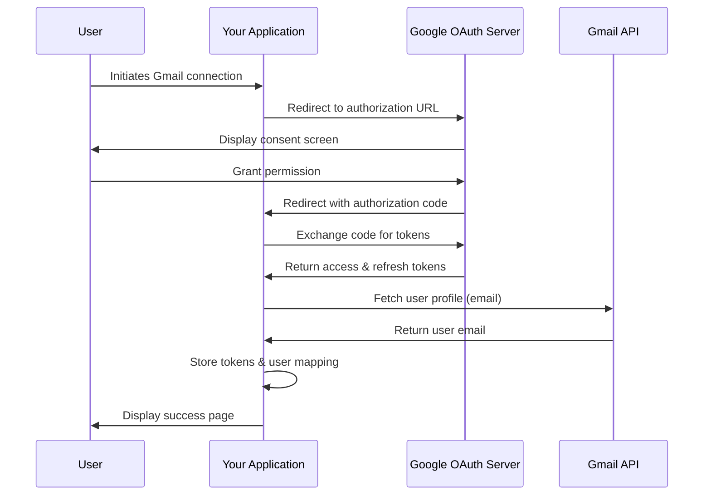

# Gmail API Integration Documentation

## Overview

This document provides a comprehensive guide to the Gmail API integration controller implemented in the application. The controller facilitates secure access to users' Gmail accounts, retrieval of email data, and management of authentication tokens.

## Table of Contents

1. [Authentication Flow](#authentication-flow)
2. [Endpoints Reference](#endpoints-reference)
3. [Data Models](#data-models)
4. [Token Management](#token-management)
5. [Security Considerations](#security-considerations)
6. [Implementation Notes](#implementation-notes)

## Authentication Flow

The integration implements OAuth 2.0 authorization flow with Google's Gmail API, supporting both temporary (6-month) and ongoing access modes.



### Access Modes

The controller supports two access modes:

1. **Temporary Access (Default)**
   - Expires after 6 months
   - Suitable for one-time imports or limited access scenarios

2. **Ongoing Access**
   - Never expires unless revoked by the user
   - Appropriate for continuous synchronization or monitoring

## Endpoints Reference

### Authorization Endpoints

#### `GET /api/Gmail/authorize`

Initiates the OAuth2 authorization flow.

**Query Parameters:**
- `ongoingAccess` (boolean, optional) - Whether to request ongoing access (true) or temporary access (false, default)

**Response:**
- Redirects to Google's OAuth consent screen

**Request Example:**
```
GET /api/Gmail/authorize?ongoingAccess=false
```

**Google Authorization URL Format:**
```
https://accounts.google.com/o/oauth2/v2/auth?
client_id={clientId}&
redirect_uri={redirectUri}&
include_granted_scopes=true&
state={stateBase64}&
response_type=code&
scope=https://www.googleapis.com/auth/gmail.readonly&
access_type=offline&
prompt=consent
```

#### `GET /api/Gmail/HandleCallback`

Processes the OAuth callback after user grants permission.

**Query Parameters:**
- `code` (string, required) - Authorization code from Google
- `state` (string, required) - Base64-encoded state parameter

**Response:**
- Redirects to success page with user details on success
- Returns 400 Bad Request with error message on failure

**Google Token Exchange Request:**
```http
POST https://oauth2.googleapis.com/token
Content-Type: application/x-www-form-urlencoded

code={code}&
client_id={clientId}&
client_secret={clientSecret}&
redirect_uri={redirectUri}&
grant_type=authorization_code
```

**Google Token Response Example:**
```json
{
  "access_token": "ya29.a0AfB_...",
  "expires_in": 3599,
  "refresh_token": "1//04u...",
  "scope": "https://www.googleapis.com/auth/gmail.readonly",
  "token_type": "Bearer"
}
```

### Data Retrieval Endpoints

#### `GET /api/Gmail/emails`

Retrieves recent emails from the user's Gmail account.

**Query Parameters:**
- `userId` (string, required) - Internal system identifier for the user

**Response:**
- 200 OK with array of email objects on success
- 400 Bad Request with error message on failure

**Response Example:**
```json
[
  {
    "id": "1860d2e4a5b3c7",
    "subject": "Weekly Report",
    "from": "John Doe <john@example.com>",
    "date": "Thu, 19 Mar 2025 14:22:13 -0400",
    "snippet": "Here is the weekly report as requested..."
  },
  {
    "id": "1853c7b2a9d5e6",
    "subject": "Meeting Invitation",
    "from": "Jane Smith <jane@example.com>",
    "date": "Wed, 18 Mar 2025 09:15:47 -0400",
    "snippet": "You're invited to our team meeting..."
  }
]
```

**Gmail API Calls:**

1. List messages:
```http
GET https://gmail.googleapis.com/gmail/v1/users/me/messages?maxResults=10
Authorization: Bearer {accessToken}
```

2. Get message details:
```http
GET https://gmail.googleapis.com/gmail/v1/users/me/messages/{messageId}
Authorization: Bearer {accessToken}
```

#### `GET /api/Gmail/user`

Retrieves information about the connected user.

**Query Parameters:**
- `userId` (string, required) - Internal system identifier for the user

**Response:**
- 200 OK with user information on success
- 400 Bad Request with error message on failure

**Response Example:**
```json
{
  "userId": "f47ac10b-58cc-4372-a567-0e02b2c3d479",
  "email": "user@example.com",
  "ongoingAccess": false,
  "expiresOn": "September 23, 2025"
}
```

## Data Models

### EmailViewModel

Represents a simplified view of an email message.

```csharp
public class EmailViewModel
{
    public string Id { get; set; }
    public string Subject { get; set; }
    public string From { get; set; }
    public string Date { get; set; }
    public string Snippet { get; set; }
}
```

## Token Management

### Token Storage

Tokens are stored securely using an implementation of `ITokenStorageService`, which should handle encryption and secure storage of sensitive credentials.

### Token Format

The controller stores tokens with additional metadata:

```json
{
  "access_token": "ya29.a0AfB_...",
  "expires_in": 3599,
  "refresh_token": "1//04u...",
  "token_type": "Bearer",
  "created": 1711198800,
  "ongoingAccess": false,
  "expirationDate": 1729198800
}
```

### Token Refresh

When an access token expires, the controller automatically refreshes it using the refresh token:

```http
POST https://oauth2.googleapis.com/token
Content-Type: application/x-www-form-urlencoded

client_id={clientId}&
client_secret={clientSecret}&
refresh_token={refreshToken}&
grant_type=refresh_token
```

## Security Considerations

1. **Token Storage:** Ensure the `ITokenStorageService` implementation uses proper encryption for tokens.

2. **Access Expiration:** The controller enforces expiration for temporary access tokens.

3. **Client Secret:** Protect your Google API client secret in secure configuration storage.

4. **Refresh Tokens:** Handle refresh tokens with extra care as they provide long-term access.

5. **Scope Limitation:** The controller only requests readonly access to Gmail.

## Implementation Notes

### Required Configuration

The controller requires the following configuration in `appsettings.json`:

```json
{
  "Authentication": {
    "Google": {
      "ClientId": "your-client-id.apps.googleusercontent.com",
      "ClientSecret": "your-client-secret"
    }
  },
  "GmailApi": {
    "ApplicationName": "Email Reader App"
  }
}
```

### Dependencies

- Google.Apis.Auth.OAuth2
- Google.Apis.Gmail.v1
- Google.Apis.Services
- Microsoft.AspNetCore.Mvc
- System.Text.Json
- ITokenStorageService (custom implementation required)

### ITokenStorageService

The controller depends on an implementation of `ITokenStorageService` which should provide methods for:

- Saving tokens
- Retrieving tokens
- Saving user mappings
- Retrieving user mappings

This interface should be implemented with secure storage practices appropriate to your application's environment.